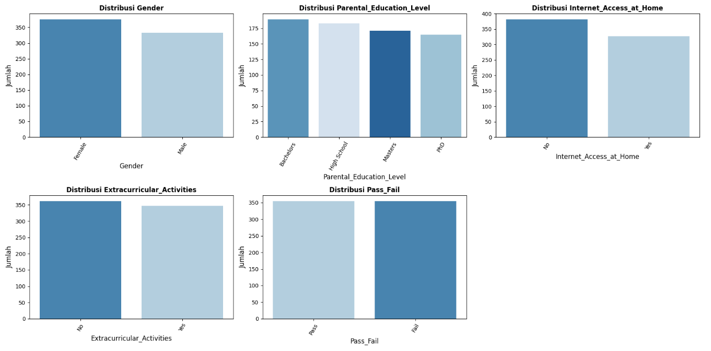

# Laporan Proyek Predictive Analytics - Margareth Serepine S

## **Domain Proyek**
Pendidikan merupakan fondasi utama dalam membangun sumber daya manusia. Keberhasilan siswa dalam studi mereka bergantung pada banyak faktor, mulai dari kebiasaan belajar, latar belakang keluarga, akses terhadap fasilitas belajar, tingkat kehadiran, hingga partisipasi dalam kegiatan ekstrakurikuler. Namun, tidak semua siswa menunjukkan performa akademik yang optimal. Dalam konteks ini, kemampuan untuk memprediksi performa akademik siswa dapat membantu guru, orang tua, dan pengambil kebijakan pendidikan dalam memberikan intervensi yang tepat waktu.

**Mengapa masalah ini penting:**
  - Intervensi dini dapat meningkatkan hasil belajar.
  - Sumber daya pendidikan dapat dialokasikan lebih efisien jika risiko kegagalan dapat diprediksi secara akurat.
  - Prediksi performa siswa berkontribusi pada pengambilan keputusan berbasis data di sektor pendidikan.

Melalui proyek ini, dikembangkan model prediksi performa akademik siswa berdasarkan atribut-atribut tertentu, dengan fokus pada klasifikasi status kelulusan. 

Riset dari Huang et al. (2020) menunjukkan bahwa metode klasifikasidapat secara efektif mengidentifikasi siswa yang berisiko gagal secara akademik dengan akurasi tinggi, memungkinkan intervensi lebih dini yang mendukung keberhasilan pendidikan.

Penelitian dari Kotsiantis, Y. B. (2012) juga menekankan model klasifikasi dapat digunakan sebagai sistem pendukung keputusan yang membantu tenaga pendidik dalam memantau dan menangani siswa yang kemungkinan besar akan menghadapi kesulitan akademik, sehingga meningkatkan efisiensi dalam pendidikan.

Serta riset dari Kumar, M., & Singh, D. (2020) menyoroti bahwa penerapan algoritma pembelajaran mesin dapat membantu institusi pendidikan dalam menyesuaikan dukungan belajar bagi siswa, berdasarkan prediksi performa yang diperoleh dari data atribut siswa seperti kebiasaan belajar, kehadiran, dan partisipasi.

**Referensi:**  
[1]Huang, S., Fang, N., & Chen, Z. (2020). "Predicting student academic performance with machine learning". Journal of Educational Computing Research, 58(2), 274–298.  
[2]Kotsiantis, Y. B. (2012). "Use of machine learning techniques for educational purposes: A decision support system for forecasting students’ grades". Artificial Intelligence Review, 37(4), 331–344.  
[3]Kumar, M., & Singh, D. (2020). "Student performance prediction using machine learning". International Journal of Engineering Research & Technology (IJERT), 9(5), 1–4.  

## **Business Understanding**
### Problem Statements
- Belum tersedianya sistem prediktif berbasis data yang dapat mengklasifikasikan kelulusan siswa secara akurat. Meskipun tersedia banyak informasi terkait siswa, seperti jam belajar, kehadiran, dan latar belakang keluarga, data ini belum secara optimal dimanfaatkan untuk membangun sistem klasifikasi yang dapat memprediksi status kelulusan secara otomatis dan akurat.
- Kurangnya pemahaman mendalam terhadap fitur-fitur yang paling berpengaruh terhadap performa akademik siswa. Institusi pendidikan sering kali kesulitan dalam mengidentifikasi variabel utama yang menentukan keberhasilan akademik siswa. Hal ini berdampak pada ketidakefisienan dalam pemberian intervensi, karena belum diketahui faktor mana yang seharusnya diprioritaskan.
- Keputusan intervensi pendidikan masih didominasi oleh intuisi daripada analisis berbasis data. Tanpa model analitik yang kuat, guru dan pihak sekolah kerap mengambil keputusan berdasarkan pengamatan subjektif, yang berpotensi salah dalam mengidentifikasi siswa yang benar-benar berisiko gagal.

### Goals
- Membangun model machine learning yang mampu memprediksi status kelulusan siswa (Pass/Fail) secara akurat dengan memanfaatkan data historis akademik dan kebiasaan siswa.
- Mengidentifikasi fitur-fitur utama yang paling berkontribusi terhadap kelulusan siswa, seperti tingkat kehadiran, jam belajar, partisipasi ekstrakurikuler, dan latar belakang keluarga.
- Menyediakan alat bantu analitik yang objektif bagi pendidik dan pengambil kebijakan untuk mendukung intervensi dini dan pengambilan keputusan berbasis data dalam dunia pendidikan.

### Solution statements
- Melakukan eksplorasi data (EDA) termasuk menghapus kolom Student_ID yang tidak digunakan serta encoding fitur kategorikal untuk meningkatkan kualitas input model.
- Menggunakan pendekatan supervised classification dengan membangun dan membandingkan dua model klasifikasi: Decision Tree dan Random Forest, untuk mengklasifikasikan status kelulusan siswa berdasarkan fitur-fitur yang tersedia dalam dataset.
- Meningkatkan performa model Random Forest melalui hyperparameter tuning dengan GridSearchCV, agar diperoleh konfigurasi parameter terbaik untuk prediksi yang optimal.
- Melakukan evaluasi model menggunakan metrik klasifikasi seperti accuracy, precision, recall, dan F1-score untuk mengukur kinerja masing-masing algoritma.
- Menganalisis hasil feature importance untuk mengidentifikasi fitur yang paling berpengaruh terhadap prediksi kelulusan, yang nantinya bisa digunakan sebagai dasar dalam pengambilan kebijakan atau intervensi pendidikan.
    
## **Data Understanding**
### Dataset
Proyek ini menggunakan dataset "Student Performance Prediction" yang berasal dari Kaggle dan dapat diakses melalui [Link Berikut](https://www.kaggle.com/datasets/amrmaree/student-performance-prediction?resource=download&select=student_performance_dataset.csv).

Dataset ini berisi informasi tentang kinerja akademik siswa, kebiasaan belajar, dan faktor eksternal yang mempengaruhi nilai ujian akhir mereka. Dataset ini dirancang untuk pemodelan prediktif, visualisasi data, dan analisis pendidikan.

Dataset ini terdiri dari 708 baris dan 10 kolom. 
- 708 baris (rows): merepresentasikan jumlah observasi atau data siswa.
- 10 kolom (columns): merepresentasikan fitur atau atribut yang tersedia untuk setiap observasi.

### Fitur pada Dataset 
Adapun fitur (kolom) yang terdapat pada dataset ini, yaitu:
 1. Student_ID : Pengenal unik untuk setiap siswa.
 2. Gender : Jenis kelamin siswa (Pria/Wanita).
 3. Study_Hours_per_Week : Jumlah rata-rata jam belajar per minggu.
 4. Attendance_Rate : Persentase kehadiran (50% - 100%).
 5. Past_Exam_Scores : Nilai rata-rata ujian sebelumnya (50 - 100).
 6. Parental_Education_Level: Tingkat pendidikan orang tua (SMA, S1, S2, S3).
 7. Internet_Access_at_Home	: Apakah siswa memiliki akses internet di rumah (Ya/Tidak).
 8. Extracurricular_Activities : Apakah siswa berpartisipasi dalam kegiatan ekstrakurikuler (Ya/Tidak).
 9. Final_Exam_Score  : Nilai ujian akhir siswa (50 - 100, nilai bilangan bulat).
 10. Pass_Fail (Target)	: Status siswa (Lulus/Gagal).

**Statistik Deskriptif Fitur Numerik**
1. Study_Hours_per_Week 
Mayoritas siswa menghabiskan waktu belajar sekitar 26 jam per minggu, dengan sebagian besar berada di rentang 19 hingga 34 jam. Nilai minimum menunjukkan ada siswa yang hanya belajar selama 10 jam, sedangkan yang paling rajin bisa mencapai 39 jam per minggu. Ini menunjukkan adanya variasi kebiasaan belajar yang cukup signifikan antar siswa.

2. Attendance_Rate 
Rata-rata kehadiran siswa adalah sekitar 78%, dengan mayoritas siswa memiliki tingkat kehadiran antara 67% hingga 89%. Walaupun ada siswa dengan kehadiran mendekati sempurna (99,97%), masih terdapat pula siswa dengan tingkat kehadiran minimal sekitar 50%. Hal ini menunjukkan tingkat kedisiplinan siswa dalam mengikuti kegiatan belajar cukup beragam.

3. Past_Exam_Scores 
Secara umum, performa akademik siswa pada ujian-ujian sebelumnya cukup baik, dengan nilai rata-rata mendekati 78 dan nilai median sebesar 79. Sebagian besar siswa memiliki nilai di antara 65 hingga 91. Terdapat siswa yang berhasil memperoleh nilai sempurna (100), meskipun ada pula yang mendapatkan nilai minimum (50). Ini menandakan bahwa secara historis, banyak siswa memiliki potensi akademik yang tinggi.

4. Final_Exam_Score 
Berbeda dengan nilai ujian sebelumnya, rata-rata nilai ujian akhir hanya sekitar 58, dengan rentang nilai yang jauh lebih sempit (50–77) dan standar deviasi yang lebih kecil. Ini menunjukkan bahwa hasil ujian akhir cenderung lebih rendah dan lebih seragam dibandingkan ujian sebelumnya. Meskipun banyak siswa memiliki latar belakang akademik yang baik, nilai akhir ini menunjukkan adanya penurunan performa secara umum.

### Tahapan Eksplorasi Data
Beberapa langkah dalam eksplorasi dan pemahaman dataset yang dilakukan:
1. **Load Data** : Mengunduh dan memuat dataset yang berjudul "Student Performance Prediction" dari Kaggle secara otomatis menggunakan kagglehub untuk menampilkan informasi mengenai data pada dataset
2. **Data Checking** : Mengecek nilai yang hilang atau kosong serta mengecek baris yang duplikat untuk penanganan selanjutnya. 
3. **Split Feature (Column) Type** : Membagi Fitur menjadi dua jenis:
    - Fitur kategorikal seperti jenis kelamin, pendidikan orang tua, ketersediaan akses internet, partisipasi siswa dalam kegiatan ekstrakurikuler, dan status kelulusan dengan tipe data object.
    - Fitur numerik seperti jam belajar, kehadiran, dan skor ujian dengan tipe data int64 dan float64.
    
### Visualisasi Data
**1. Visualisasi Fitur Numerik** : menampilkan histogram dari seluruh fitur numerik dalam dataset, untuk melihat distribusi data masing-masing kolom.

Distribusi hasil visualisasi:
-  Study_Hours_per_Week : Distribusi menunjukkan sebagian besar siswa belajar antara 30–40 jam per minggu. Sebagian besar siswa memiliki waktu belajar mingguan yang tinggi.
- Attendance_Rate : Distribusi relatif merata, tetapi ada konsentrasi tinggi di kisaran 80–100%. Mayoritas siswa memiliki tingkat kehadiran tinggi, menunjukkan disiplin yang cukup baik dalam mengikuti kelas.
- Past_Exam_Scores : Distribusi sedikit condong ke kiri (negatif skewed, dengan banyak siswa mendapat nilai ujian sebelumnya tinggi (80–100). Rata-rata siswa memiliki performa akademik yang baik pada ujian sebelumnya.
- Final_Exam_Score : Distribusi sangat condong ke kanan (positif skewed), menunjukkan mayoritas siswa mendapatkan nilai ujian akhir yang rendah, yakni antara 50–65. Sangat sedikit siswa yang mendapat nilai di atas 70. Terdapat penurunan performa pada ujian akhir, meskipun performa sebelumnya tinggi.

**2. Visualisasi Nilai Outlier Fitur Numerik** : memberikan gambaran tentang nilai sebaran data (outlier) untuk masing-masing variabel numerik.

Distribusi hasil :
- Tidak ada outlier ekstrem dalam fitur numerik yang ditampilkan.
- Distribusi nilai cukup normal dan simetris.
- Data cukup bersih dan siap untuk proses pemodelan, tanpa perlu penanganan outlier besar.

**3. Visualisasi Fitur Kategorikal** : memvisualisasikan distribusi frekuensi dari setiap fitur kategorikal dalam dataset untuk memahami jumlah atau proporsi setiap kategori dari fitur-fitur tersebut, memberikan gambaran awal tentang komposisi data kategorikal.

Distribusi hasil visualisasi:
- Gender: Menunjukkan bahwa jumlah perempuan (Female) sedikit lebih banyak dibandingkan laki-laki (Male). Jadi, distribusi gender cukup seimbang, tetapi perempuan sedikit mendominasi dalam data ini.
- Parental_Education_Level : Sebagian besar orang tua memiliki pendidikan tingkat Bachelor dan High School. Jumlah orang tua dengan gelar PhD yang paling sedikit. Mayoritas siswa berasal dari keluarga dengan latar belakang pendidikan menengah hingga sarjana.
- Internet_Access_at_Home : Mayoritas siswa tidak memiliki akses internet di rumah, sedikit lebih banyak daripada yang memiliki.
- Extracurricular_Activities : Jumlah siswa yang tidak mengikuti kegiatan ekstrakurikuler sedikit lebih banyak daripada yang mengikuti. Keterlibatan dalam aktivitas ekstrakurikuler cukup berimbang, dengan sedikit kecenderungan untuk tidak ikut.
- Pass_Fail: Jumlah siswa yang lulus (Pass) hampir sama dengan yang gagal (Fail). Performa akademik siswa cukup seimbang antara yang berhasil dan tidak berhasil.

**4. Visualisasi Matriks Korelasi Fitur Numerik** : Menganalisis hubungan linier antar fitur numerik dalam dataset untuk mengidentifikasi fitur yang memiliki hubungan positif kuat, negatif kuat, atau hampir tidak ada hubungan sama sekali.

Distribusi hasil : 
- Secara visual dan numerik mengkonfirmasi hubungan antar fitur, menyoroti faktor-faktor yang berpotensi memengaruhi 'Final_Exam_Score'.
- Hasil menunjukkan bahwa 'Past_Exam_Scores' dan 'Attendance_Rate' adalah prediktor yang cukup baik untuk 'Final_Exam_Score', karena keduanya memiliki korelasi positif sedang.

## **Data Preparation**
Beberapa teknik data preparation yang dilakukan adalah:
### Data Cleaning 
Menghapus semua baris yang terdeteksi duplikat yang bisa menyebabkan bias dan menghapus fitur (kolom) 'Student_ID' yang tidak relevan karena hanya berfungsi sebagai identifikasi unik tanpa nilai analitis.
### Encoding Fitur kategorikal
 Mengubah fitur kategorikal menjadi format numerik yang dapat diproses oleh algoritma machine learning. Dengan menggunakan LabelEncoder, setiap kategori unik dalam suatu kolom direpresentasikan sebagai bilangan bulat. 
 
 Hal ini diperlukan memastikan data siap untuk tahap pemodelan, memungkinkan algoritma untuk bekerja dengan data dan mengekstrak pola.
 
 **Label encoding tiap fitur:**
- Gender: 'Female' = 0, 'Male' = 1
- Parental_Education_Level: 'Bachelors' = 0, 'High school' = 1, 'Masters' = 2, 'PhD' = 3
- Internet_Access_at_Home: No = 0, Yes = 1
- Extracurricular_Activities: No = 0, Yes = 1
- Pass_Fail: Fail = 0, Pass = 1

### Data Spliting
Memisahkan data fitur dan target, lalu melakukan pembagian dataset menjadi 80% data pelatihan (training) dan 20% pengujian (testing) sebelum dilakukan proses pemodelan. Dimana Total Data sebanyak 500, dengan pembagian data yaitu : 
- Train Data : 400
- Test Data : 100

Tahapan ini perlu dilakukan agar model tahu mana input dan mana target yang harus diprediksi. Serta model bisa belajar dari data latih dan model bisa diuji pada data yang belum pernah dilihat untuk menilai performa secara objektif dan mencegah overfitting.

## **Modeling**
Membangun dan membandingkan model machine learning guna mengklasifikasikan status kelulusan siswa (Pass/Fail) berdasarkan fitur-fitur yang tersedia dalam dataset. Dalam proyek ini, digunakan dua algoritma klasifikasi yaitu Decision Tree dan Random Forest, disertai proses peningkatan performa melalui hyperparameter tuning.
Tahapan ini membahas mengenai model machine learning yang digunakan untuk menyelesaikan permasalahan. Anda perlu menjelaskan tahapan dan parameter yang digunakan pada proses pemodelan.

### 1. Decision Tree Classifier
Algoritma berbasis struktur pohon, dimana setiap simpul mewakili pengambilan keputusan terhadap fitur tertentu. 
Model Decision Tree dibangun menggunakan DecisionTreeClassifier dari pustaka sklearn.tree, kemudian dilatih pada data training. Prediksi dilakukan pada data test dan evaluasi menggunakan metrik akurasi, precision, recall, dan F1-score.  
**Parameter yang digunakan:**  
"random_state=42", untuk memastikan reprodusibilitas hasil.  

**Kelebihan:**
- Mudah dipahami dan divisualisasikan.
- Tidak memerlukan normalisasi atau scaling fitur.
- Mampu menangani fitur kategorikal dan numerik.

**Kekurangan:**
- Rentan terhadap overfitting.
- Performanya sering kali kurang optimal dibandingkan algoritma ensemble seperti Random Forest.

### 2. Random Forest Classifier
Algoritma ensemble yang terdiri dari beberapa Decision Tree untuk menghasilkan model yang lebih stabil dan akurat. Setiap pohon dilatih pada subset data yang berbeda dan hasil prediksi diambil berdasarkan mayoritas. 
Model dibangun menggunakan RandomForestClassifier dari sklearn.ensemble, dan dilatih dengan parameter default terlebih dahulu.

**Kelebihan:**
- Lebih akurat dan tahan terhadap overfitting dibanding Decision Tree tunggal.
- Dapat mengatasi data yang tidak seimbang dengan baik.
- Memberikan feature importance yang bermanfaat untuk interpretasi.

**Kekurangan:**
- Lebih kompleks dan memakan waktu komputasi lebih besar.
- Sulit diinterpretasi secara keseluruhan karena terdiri dari banyak pohon.  

**Hyperparameter Tuning (Improvement Random Forest)**  
Mencari kombinasi parameter terbaik agar performa model Random Forest dapat meningkat, dan model dapat melakukan prediksi dengan akurasi tinggi, menghindari overfitting maupun underfitting.

Proses improvement: 
-  Menentukan Parameter yang Akan Dituning. Beberapa parameter yang digunakan:
    1. n_estimators: Jumlah pohon dalam ensemble. Lebih banyak pohon bisa meningkatkan akurasi, tetapi juga meningkatkan waktu komputasi. [50, 100, 150, 200]
    2. max_depth: Kedalaman maksimum setiap pohon. Membatasi kedalaman bisa menghindari overfitting. [None, 10, 20, 30]
    3. min_samples_split: Jumlah minimum sampel yang diperlukan untuk membagi suatu simpul. [2, 5, 10]
    4. min_samples_leaf: Jumlah minimum sampel yang harus ada di daun pohon (leaf node). [1, 2, 4]
-  Menyusun Grid Parameter. Mendefinisikan kombinasi nilai-nilai untuk setiap parameter dalam bentuk dictionary
-  Mencari Kombinasi Terbaik dengan GridSearchCV. Mencoba semua kombinasi parameter, lalu mengevaluasi kinerja masing-masing menggunakan cross-validation.
-  Mengambil Model Terbaik. Setelah seluruh proses selesai, model terbaik bisa langsung diambil. Dan bisa juga melihat parameter terbaik dan skor validasi terbaik. 
-  Evaluasi Model Terbaik. Model terbaik kemudian diuji pada data testing, untuk mengevaluasi kemampuannya.

**Parameter Terbaik berdasarkan hasil Tuning :**
- 'n_estimators': 100,
- 'max_depth': 30,
- 'min_samples_split': 5,
- 'min_samples_leaf': 1.

#### Pemilihan Model Terbaik
Setelah dilakukan evaluasi pada kedua algoritma:
1. Decision Tree menghasilkan performa yang cukup baik namun menunjukkan kecenderungan yang rentan terhadap overfitting.
2. Random Forest Classifier dengan Hyperparameter Tuning menunjukkan hasil yang lebih akurat, stabil, dengan generalisasi yang lebih baik pada data testing.  

Oleh karena itu, model Random Forest Classifier dengan Hyperparameter Tuning dipilih sebagai model terbaik dalam penyelesaian permasalahan ini.

## **Evaluation**
### Metrik Evaluasi yang Digunakan
Karena proyek ini merupakan kasus klasifikasi biner (target: status kelulusan siswa Pass atau Fail), maka digunakan beberapa metrik klasifikasi yang umum dan relevan untuk mengevaluasi performa model, yaitu:
1. **Accuracy** : Mengukur proporsi prediksi yang benar dari seluruh prediksi. Dalam kasus ini, target cukup imbalanced, sehingga metrik tambahan juga penting.
2. **Precision** : Mengukur seberapa banyak prediksi positif (Pass) yang benar. Berguna untuk menilai risiko "false positive", seperti memprediksi siswa lulus padahal gagal.
3. **Recall** : Mengukur seberapa banyak kasus positif yang berhasil ditangkap oleh model. Untuk sebisa mungkin mengidentifikasi siswa yang sebenarnya lulus.
4. **F1-Score** : Harmonik rata-rata dari precision dan recall, cocok jika kita ingin menyeimbangkan keduanya.

### Hasil Berdasarkan Metrik Evaluasi
**1. Decision Tree Classifier**

Model Decision Tree menunjukkan hasil sempurna (100%) di seluruh metrik evaluasi, baik pada kelas "Pass" maupun "Fail". Artinya, model mampu memisahkan kedua kelas tanpa kesalahan. Namun, hasil ini juga perlu diwaspadai sebagai kemungkinan overfitting, terutama jika data terlalu sederhana atau tidak cukup variatif.

**2. Random Forest Classifier (Hyperparamater Tuning)**

Model Random Forest juga menunjukkan akurasi sempurna, bahkan setelah dilakukan hyperparameter tuning. Hal ini mengindikasikan bahwa model berhasil menggeneralisasi pola dengan sangat baik di dataset ini. Akan tetapi, seperti pada Decision Tree, perlu dilakukan cross-validation tambahan atau pengujian di data lain untuk menghindari asumsi keliru karena kemungkinan overfitting.

**Feature Importance**  
Random Forest Classifier juga menampilkan fitur-fitur paling berpengaruh. Berdasarkan hasil feature importance fitur-fitur yang paling signifikan yaitu:
1. Final_Exam_Score
2. Past_Exam_Scores

Maka dari itu, nilai ujian akhir dan nilai ujian sebelumnya menjadi hal yang paling berpengaruh dalam menentukan kelulusan siswa. Fitur-fitur ini sejalan dengan logika domain pendidikan, dan dapat digunakan sebagai dasar untuk intervensi kebijakan akademik.
